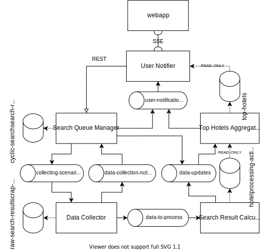

Tracks hotel prices for specific search places.

#### Dev environment:
`docker-compose build`

`docker-compose up -d`

Make a request to start collecting data for your search place: 
```
POST http://localhost:38081/api/v1/search-requests

{
  "updateFrequencyMinutes": 5,
  "resultsLimit": 300,
  "searchPlace": "Warsaw",
  "checkInDate": {
    "year": 2021,
    "month": 6,
    "day": 11
  },
  "checkOutDate": {
    "year": 2021,
    "month": 6,
    "day": 20
  },
  "numberOfRooms": 1,
  "numberOfAdults": 2,
  "childrenAgeAtCheckout": [1]
}
```
Logs and results can be found here -> `./compose-output`

Access the web application at `http://localhost:30000`

#### Prod environment:

Rename `prod.env.example` -> `prod.env` and fill in missing values

`docker-compose -f docker-compose.yml -f docker-compose.prod.yml build`

`docker-compose -f docker-compose.yml -f docker-compose.prod.yml up -d`

#### Architecture:



#### Architecture implementation on a production environment:


